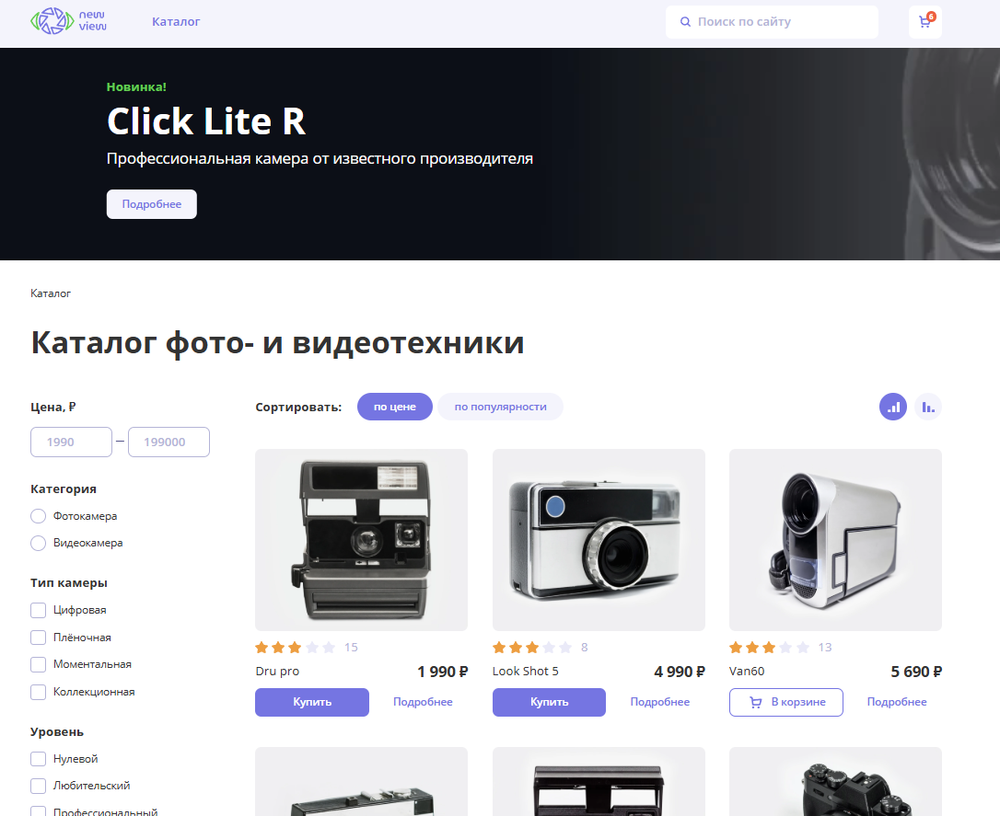

# Camera Shop — интернет-магазин фототехники

**Live Demo:** https://camera-shop-alpha.vercel.app/
**Screenshots:**

[Карточка товара](./assets/screenshots/2.png)
[Отзывы](./assets/screenshots/3.png)
[Корзина](./assets/screenshots/4.png)


## 📌 Описание проекта
**Camera Shop** — веб-магазин фототехники с каталогом товаров, корзиной, фильтрацией, сортировкой и оформлением заказа.  
Приложение построено на **React + TypeScript** и реализует основные функции полноценного e-commerce сервиса.

Проект включает работу с серверным API: загрузку списка товаров, управление корзиной, добавление отзывов и обработку различных пользовательских действий.

---

## 🎯 Основной функционал

### 📷 Каталог товаров
- Загрузка списка товаров с сервера.
- Пагинация по страницам (`?page=1`, `?page=2` и т.д.).
- Сортировка по:
  - цене,
  - рейтингу.
- Фильтрация по:
  - типу камеры,
  - категории,
  - уровню пользователя.

### 🧺 Корзина
- Добавление товаров.
- Удаление.
- Изменение количества.
- Итоговая стоимость заказа.
- Промокод (при наличии в проекте).

### ⭐ Отзывы
- Просмотр отзывов к товару.
- Добавление нового отзыва.
- Валидация формы.

### 🔄 Взаимодействие с API
- Получение списка товаров и их деталей.
- Получение и отправка отзывов.
- Отправка данных корзины.
- Обработка ошибок и состояний загрузки.

---

## 🛠️ Технологический стек

### Frontend
- **React 18**
- **TypeScript**
- **Vite**
- **React Router DOM**
- **Redux Toolkit**
- **React Redux**
- **Axios**
- **Yup**, **React Hook Form**, **@hookform/resolvers** — валидация форм
- **React Helmet Async** — управление метаданными
- **React Toastify** — уведомления
- **Dayjs** — работа с датами
- **Lodash** — утилиты
- **Swiper** — слайдеры
- **Leaflet** — интерактивные карты (если используется в проекте)

### Тестирование
- **Vitest**
- **Testing Library (React, Jest-DOM, User Event)**
- **JSdom**
- **Redux Mock Store**
- **Axios Mock Adapter**

### Инфраструктура и качество кода
- **ESLint**, **@typescript-eslint**
- **eslint-config-htmlacademy**
- **Browserslist**

---

## 🧪 Особенности реализации
- Разделение логики на отдельные модули.
- Типизация всего приложения с использованием TS.
- Управление состоянием через Redux Toolkit.
- Создана чёткая архитектура каталог → товар → корзина.
- Реактивные фильтры + сортировка.
- Пагинация через параметры URL.

---

## 📦 Установка и запуск

```bash
npm install
npm run dev
